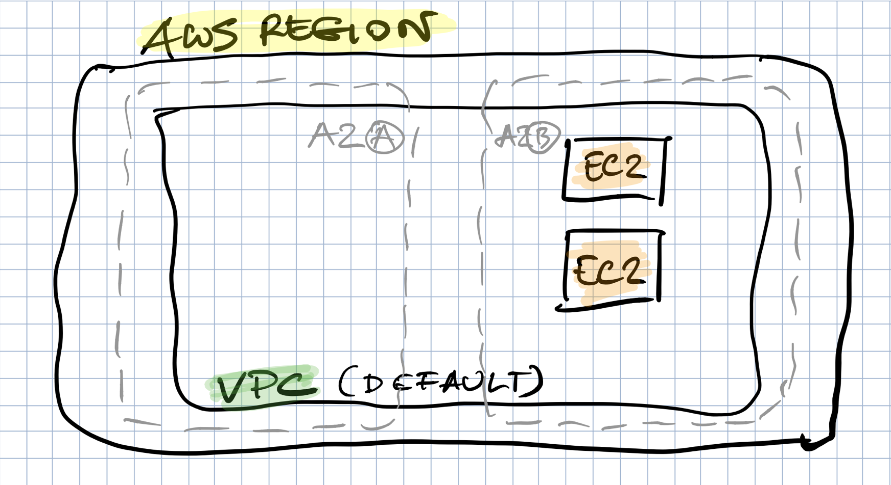

# CHALLENGE 3


## Diagram




## Exercise 1 - EC2 Remote Provisioner

- Provision an EC2 instance, update packages and install Python3 using `remote-exec` provisioner.
- Update `base.tf`: add two tags - Team: 'DataScience', Environment: 'IE-Stage'
- Apply changes by running terraform plan and terraform apply

Initialize terraform environment:
```bash
$ terraform init
```

Run terraform plan:
```bash
$ terraform plan
```

Apply changes described in the `main.tf` file:
```bash
$ terraform apply
```

- Verify you can `ssh` to the provisioned EC2 instance
- Verify Python3 is installed (run `python3` command)
```bash
$ python3
```
- Refactor `base.tf`, move hardcoded variables to the `VARIABLES` section
```bash
region     = "eu-west-1"
ami = "ami-0181f8d9b6f098ec4""
instance_type = "t1.micro"
```
- Apply changes (`terraform plan`, `terraform apply`)
- Destroy created infrastructure
```bash
$ terraform destroy
```