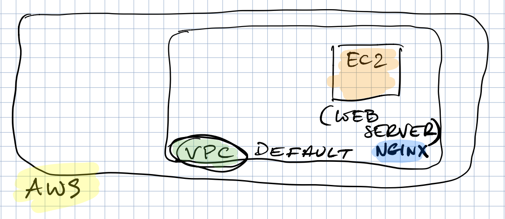

# CHALLENGE 4

## Diagram



## Exercise 1 - External Variables

- Create (if not present) a file `variables.tf`
- Refactor `base.tf` - move following variables to the external `variables.tf` file
```bash
region = "eu-west-1"
ami = "ami-047bb4163c506cd98"
instance_type = "t1.micro"
```
- Add a new tag to EC instance:
```bash
TeamBase = "DublinIE-HQ"
```

- Update `base.tf` file - reference vars from `variables.tf`
- Add missing variables to the AWS provider definition in `base.tf`
- Provision EC2 instance
- Verify WebServer is up and running (use web browser)
